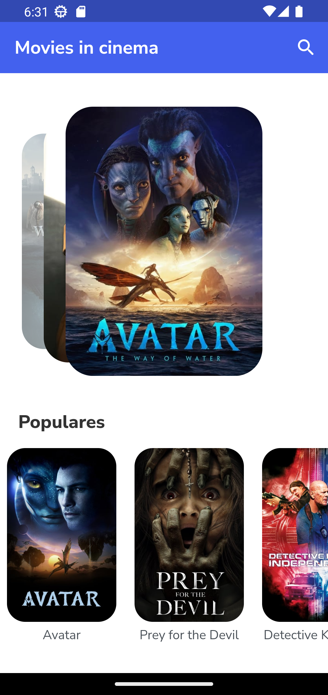
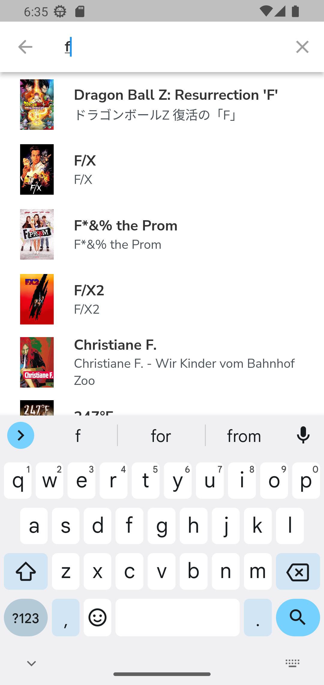

# Movie app
An application that deals with movies, you can see reviews among other things, By the way it consumes the API of [themoviedb](https://www.themoviedb.org/).
## Development 
### Project structure
In the `assets` folder are all the files used by the application.

- **themes:** Files that contain the theme of the application.
- **screen:** The screen that the user can see.
- **widget:** They are like components, the screen folder depends on them.
- **models:** the type that has the json, which we consume.
- **providers:** Consumes the API and provides our application.
- **search:** the search engine.

### My experience developing
An app that turned out to be a bit simple, since I use some flutter dependencies. I learned to consume an API and use some more widgets. This application was developed with the aim of practicing and learning a little more about flutter. Soon I will develop a slightly more complex application that consumes an API.

### Technologies used in the project

1. [Flutter](https://flutter.dev/)
2. [Dart](https://dart.dev/)
3. [http](https://pub.dev/packages/http)
4. [card_swiper](https://pub.dev/packages/card_swiper)
5. [provider](https://pub.dev/packages/provider)

## Demo 

You can see the app running, just open the terminal and enter the following commands:
```
git clone https://github.com/YerikAH/movies-app
cd movies-app
flutter run
```
### Screenshots




## Author

- Harvey Yerik

    - [Twitter](https://twitter.com/yerikhar)
    - [GitHub](https://github.com/YerikAH)
    - [Send Me A Message](https://yerikah.github.io/send-me-a-message/dist/)
